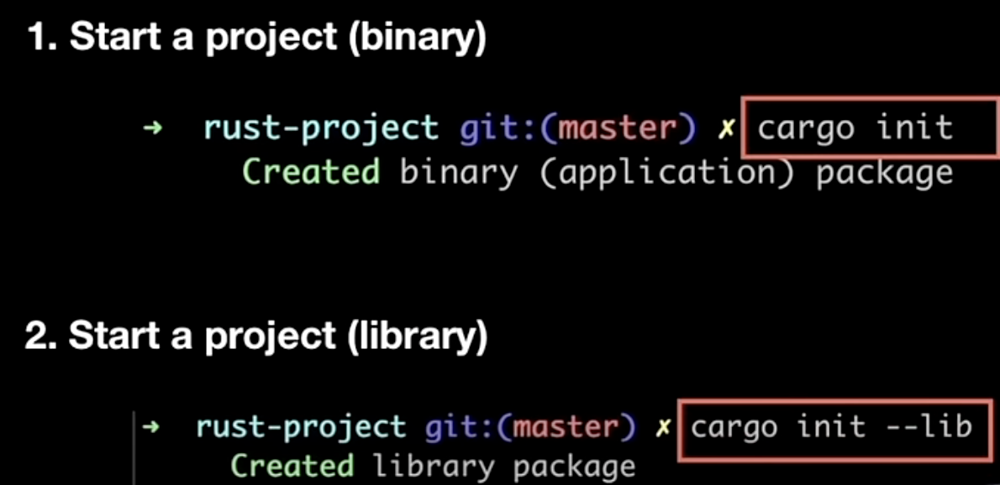
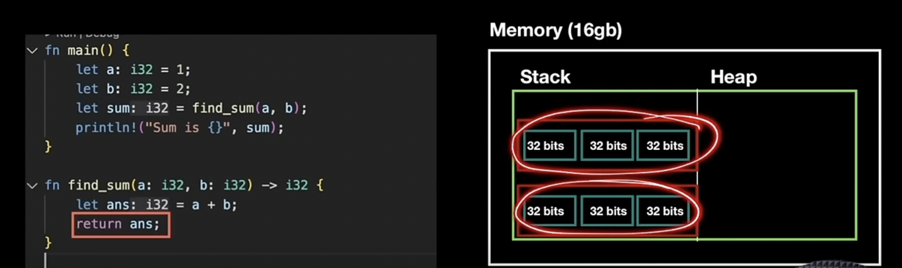
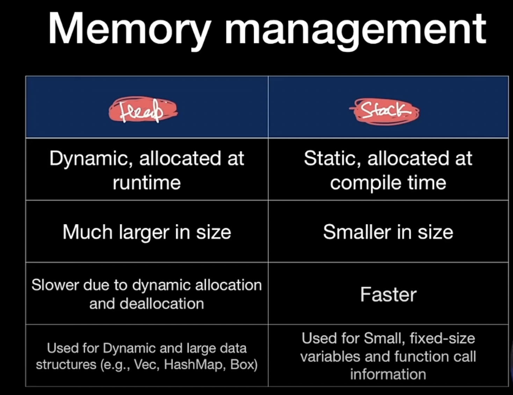
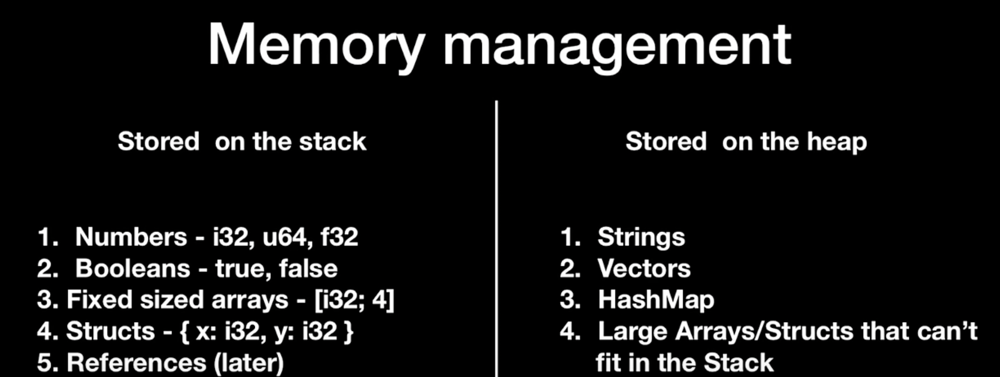
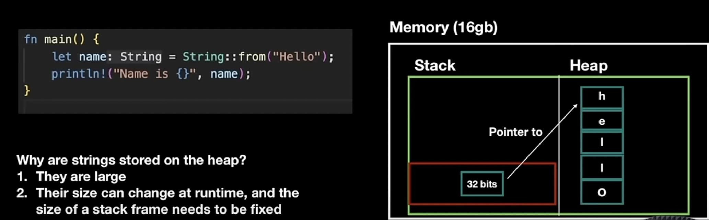
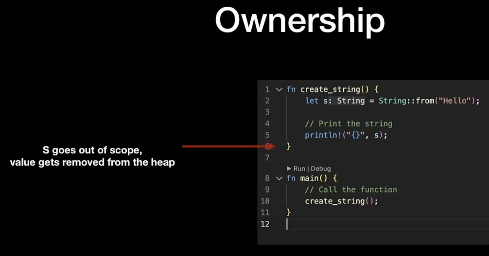
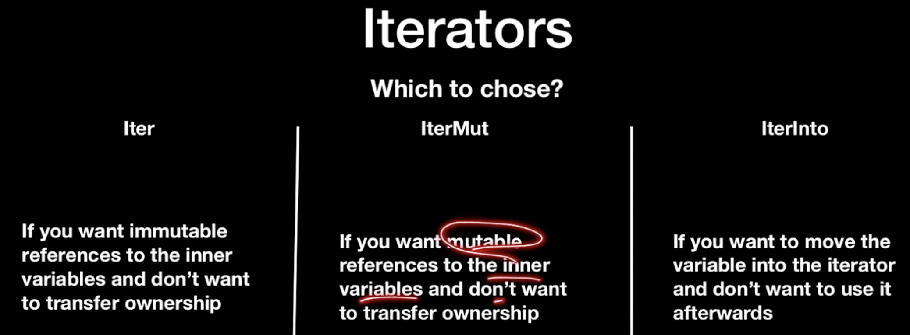
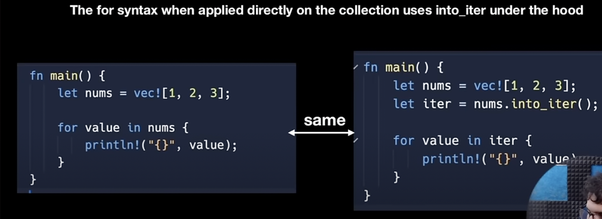

# completeRustTutorial

## Two ways to create a rust project

- one is end user application. command is `cargo init`
- second is library `cargo init --lib`

## println is a macro. It is not a function.

## Enums

- There are some enums Rust provides you by default specifically the Option and the Result enum

## Package mangement

- in Rust external library is called crate. So to add a new crate to the project enter `cargo add chrono` to the
  terminal.

## Memory allocation

## Ownership rules

- Each value in Rust has a owner
- There can be only one owner at a time
- When the owner goes out of scope, the value will be dropped.

## Rules of reference
- At a given time you can have either one mutable reference or any number of immutable references.

## Iterators

the for syntax when directly applied on the collection uses into_iter under the hood.

## consuming adapters
- Methods that call next are called consuming adaptors, because calling them uses up the iterator.

## Iterator adapters
- Iterator adapters are methods defined on the iterator trait that don't consume the iterator, Instead they produce 
different iterators by changing some aspect of the original iterator.